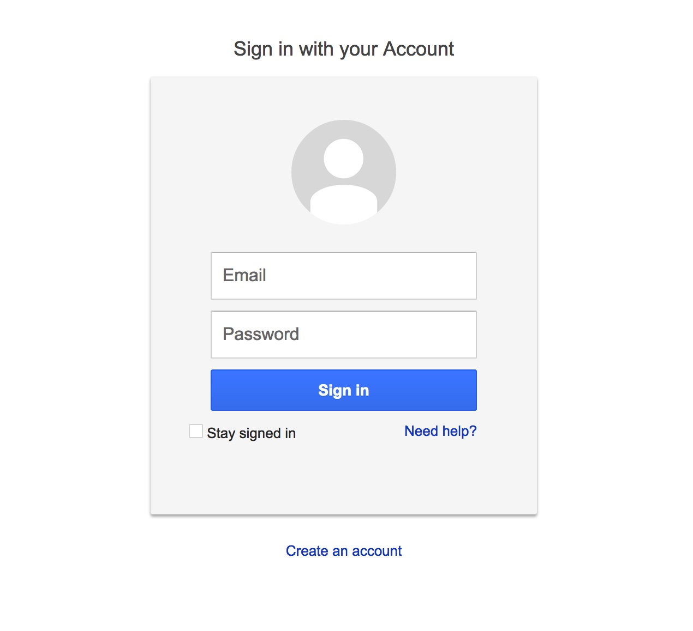
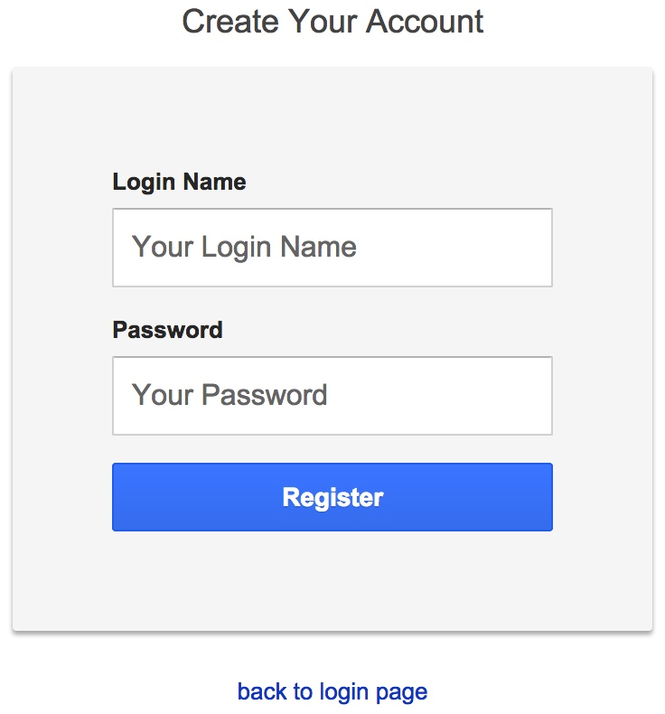

# Morgan WebMail Project

This is a webmail project written by Morgan Zhang for the Principle of Software Development course assignment.

## Now Pages

## What's done
##### Before Forth Monday
- Add SSL
- Add DecodeManager
- Inbox kind of work
- Show email kind of work

##### Before Third Monday
- Receive email through POP
- Store email in DB
- Achieve User Register, Log in, Log out with Ajax method
- Add UserManager, CookieManager
- Update Ajax to use JSON
- Study how to debug
- Add POST handler
- Add SQL Query Handler
- Achieve Ajax POST

##### Before Second Monday
- Login Page UI, User Register Page UI
- Wiki
- Milestone and Issues Setting
- Study gitignore syntax
- Study MarkDown syntax
- Connect to SQLite database
- Jetty setting

##### Before First Monday
- Study use Digital Ocean
- Study HTML, CSS, JavaScript, BootStrap, jQuery